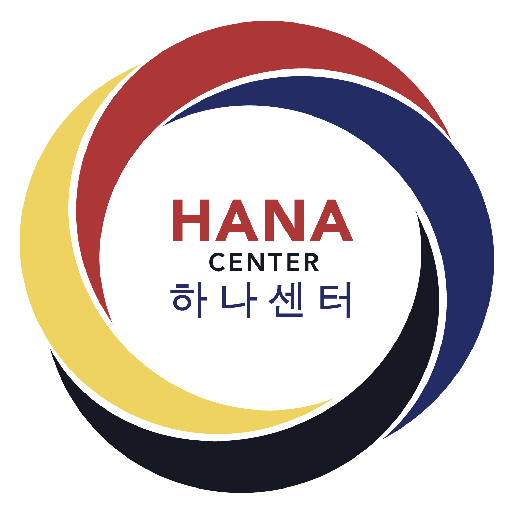

# Program Information

## Curriculum

Hanuri Korean School’s curriculum includes:

- Age- and level-appropriate language lessons
- Korean culture lessons, including major celebrations, historical events, and notable people
- Korean American history
- Korean drumming lessons
- Traditional Korean dance
- Hands-on art classes

## Class Schedule

| Time          | Activity                                                            |
| ------------- | ------------------------------------------------------------------- |
| 09:45 - 10:00 | Drop-off                                                            |
| 10:00 - 12:00 | Language class                                                      |
| 12:00 - 12:10 | Snack break                                                         |
| 12:10 - 01:00 | Cultural enrichment class (art, drumming or traditional dance) |
| 01:00 - 01:15 | Pick-up                                                             |

## Location

[HANA Center](https://hanacenter.org) ([Google Maps](https://maps.app.goo.gl/PKJBihG2c4KfwRka9)) 
4300 N California Avenue 
Chicago, IL 60618

Hanuri Korean School meets at HANA Center but is its own independent organization. Please direct all questions to [hanurikoreanschool@gmail.com](mailto:hanurikoreanschool@gmail.com), not HANA Center.

Thank you to HANA Center for generously sharing their space with us!

## Calendar

Classes meet on **Saturdays, 10 AM - 1 PM**.

- **Fall semester**: September 12, 2026 - January 30, 2027
- **Spring semester**: February 20 - June 12, 2027

See [2026-2027 School Year Calendar](../calendar-2026-2027.pdf) for more details. Dates are subject to change.

## Tuition

The 2026-2027 tuition rates are:

| Number of students | Fall semester           | Spring semester         |
| ------------------ | ----------------------- | ----------------------- |
| One student        | $450                    | $360                    |
| Two students       | $870 (discount of $30)  | $696 (discount of $24)  |
| Three students     | $1260 (discount of $90) | $1008 (discount of $72) |

Rates are subject to change.

Tuition payments can be made with a one-time payment in full or via monthly installments. Full instructions on how to pay either online or by check will be included in the confirmation email, which you will receive within 4-5 business days once you submit the [registration form](https://forms.gle/94the6pNzJ8rkif88).

We believe that tuition should not be a barrier for interested families. Please contact [hanurikoreanschool@gmail.com](mailto:hanurikoreanschool@gmail.com) for more information about various options.
